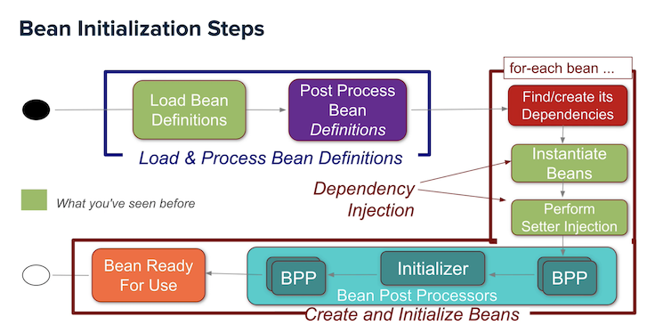
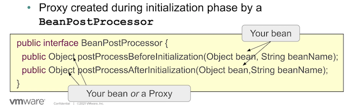
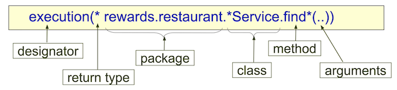

# Spring framework

- opensource framework: helps focus on business logic (pojo programing model)
- lightweight
- DI container (IOC) : spring instantiates and injects dependencies into objects (lifecycle management)
- no need for Java EE application server
- Key principles: DRY, SOC, Convention over config, Testability

# Configuration

- Spring separates application config from application objects (beans)
- Spring manages Objects
  - creates and initialize them 
- Spring gives unique id/name to beans
- Spring Application Context represents Spring DI Container
  - can be created in any env (standalone, web app, JUnit test)
- multiple config with `@Import(MyClass.class)`
- Bean scopes
  - `singleton` (default): single instance
  - `prototype`: new instance created each time the bean is referenced
  - `session`: new instance created once per user session (web only)
  - `request`: new instance created once per request (web only)
  - web socket scope
  - refresh scope
  - thread scope
  - custom scope
- Accessing **external properties**:
  - `@PropertySource("file.properties")` on class
  - or `@Value` on parameter
- Spring **profiles**:
  - can represent 
    - an env (dev, test prod)
    - an impl (jdbc, jpa)
    - a deployment platform (one-premise, cloud)
  - beans are grouped into profiles
  - `@Profile("dev")` or `@Profile("!prod")` can be at
    - class level
    - method level
  - activated at run time with
    - command line : `-Dspring.profiles.active=dev`
    - programmatically: `System.setProperty("spring.profiles.active","dev")` before `SpringApplication.run(AppConfig.class);`
    - Integration Test only: `@ActiveProfiles`
    - with `@Value("${maxAttempts}")`
- Spring **Expression Languages** (SpEL):
   - with `@Value("#{maxAttempts}")` 
     - accessing system properties
     - accessing spring beans
   - can provide a fallback with `@Value("#{maxAttempts: 5}")`

## Component Scanning
- Annotation-based configuration within bean-class `@Configuration @Bean` vs component-scanning with `@Component`
- `@Autowired(required = false)` default is true
- `@Qualifier("beanName")` in parameter or property (after @Autowired )
- `@Component` name auto-generated de-capitalized
- `@Lazy @Component` bean created when dependency injected or when `ApplicationContext.getBean` (default true)
- `@PostConstruct` invoked during bean-creation process (javax not Spring)
- `@PreDestroy` called when ConfigurableApplicationContext is closed. (javax not Spring)
- or alternatively`@Bean(initMethod="populateCache",destroyMethod=""flushCache")`
 
# Spring Container

## LifeCycle


*Spring Beans Initialization Steps*
### Initialization: beans created, DI occurs
#### A.Load & Process : #What should we create ? (Keeps Beans Definition In Memory)
- Load Beans (javaconfig, xml, annotations,component scan ) 
    - gather information about the application context (AC is a BeanFactory)
        - AC BeanFactory : gather bean name, type, scope 
- Post Process Beans Definition 
    - interface BeanFactoryPostProcessor
        - can modify any bean definition before any objects are created
        - some implementation provided by spring : reading properties (`@Value("${max.retries}")`), registering custom scope...
        - Use STATIC for custom BFPP: `@Bean public static BFPP mycustomConfigurer() {}`
#### B. Create and initialize each bean
- Bean created 
    - in right order based on dependencies
    - force dependency order  with `@DependsOn("beanName)`
- Bean initialized *eagerly* (unless marked *lazy*)
    - DI: Instantiate + Setter Injection
- Post Process at bean level BPP(before init & after init)
- Bean ready to use
### Usage: beans available
During previous BPP, bean can be:
1. Just a bean
2. a Proxy

*Bean Or Proxy*

Spring suppports 
- JDK proxy
    - interface based (#implements)
- *CGLib Proxy* 
    - subclass based (#extends)

### Destruction: beans clean up 

1. Any registered `@PreDestroy` methods are invoked
=> Don't happen if application is killed or fails

2. Beans released for Garbage Collection

# Spring AOP (Aspect Oriented Programming)

AOP enables modularization of cross-cutting concerns

**cross-cutting concerns**: generic functionnality needed in many place in the app
- logging and tracing
- transaction management
- security
- caching
- error handling
- perf monitoring
- custom business rules

AOP avoids:
- code tangling: coupling of concers (hard to test)
- code scattering: same concern spread across modules (code duplicates)

AOP technologies:
- Aspect J (JDK proxy)
- Spring AOP (`@Configuration @EnableAspectJAutoProxy`)
 AOP happens during initialization phase: spring wraps the component in a proxy  

## AOP Concepts
### Join Point
method call or exception trown
### Pointcut
expression that select one or more join points



- `*` matches only once
- `..` matches zero or more

Any class annnotated *@Cacheable*:

```java
@Before(value = "execution(@example.Cacheable * rewards.. *.*(..))")
```

### Advice
code to be executed at each join point with:
- `@Before(value= "pointcut execution")`
- `@AfterReturning(value = "", returning="reward")`
- `@AfterThrowing(value="", throwing= "ex")` can return a different type of exception
- `@After()`
- `@Around()` 
    - for before and/or after 
    - need to implement `proceed()` method

### Aspect
module (java class) that encapsulates pointcuts and advice annotated with `@Aspect`
### Weaving
technique by which aspects are combined with main code
### Proxy
someone else, web proxy etc. 
### AOP Proxy
class that stand in place (transaction, caching etc.)

## AOP Limits
- only non-private method
- only aspects to spring beans
- weaving proxies inner calls: suppose method @() calls method b() on the same class/interface then advice will never be executed for method b()

# @DirtiesContext

- forces Spring to start with a clean slate, as if those other tests hadn't been run.
- add this annotation to all tests which change the data. If not, then these tests could affect the result of other tests

# Spring Web

- @RestController @RequestMapping("/cashcards")
    - @PostMapping, @PutMapping("/{id}"), @GetMapping("/{id}") @DeleteMapping"/{id}"


## ResponseEntity
- Spring Web (or http) provides the .created()
    - ResponseEntity.created(uriOfCashCard).build(); => returns the uri in the Header Location
- UriComponentsBuilder ucb: method argument to POST handler method automatically passed in (injected from our friend, Spring's IoC Container.)
- restTemplate
    - withBasicAuth(user, pwd) 
    - getForEntity(url, responseType) => returns ResponsEntity
    - postForEntity(url, request, responseType) => returns ResponsEntity
    - putForEntity() DOES NOT EXIST!
    - exchange(url, method, request, responseType) => returns ResponsEntity
    - delete => returns void

# Spring Data

## PagingAndSortingRepository

- comes from Spring Data Pagination API
    - Provides `PageRequest` and `Sort` classes for pagination
- implements CrudRepository
- Spring Data's CrudRepository provides methods that support creating, reading, updating, and deleting data from a data store. cashCardRepository.save returns the saved object with a unique id provided by the database.

```java
Page<CashCard> page2 = cashCardRepository.findAll(
    PageRequest.of(
        1,  // page index for the second page - indexing starts at 0
        10, // page size (the last page might have fewer items)
        Sort.by(new Sort.Order(Sort.Direction.DESC, "amount"))));
```

## Pageable
allows Spring to parse out the 'page' number and 'size' query string parameters.
getSortOr() : no default so has to be specified

```java
PageRequest.of(
                   pageable.getPageNumber(),
                   pageable.getPageSize(),
                   pageable.getSortOr(Sort.by(Sort.Direction.DESC, "amount"))));
```
## Page
`page.getContent()`

# Security

## Authentication

- act of Principal proving its identity to the system
- `Principal` : user of an API, person or  program.
- Principal provides credentials:
    - eg a Basic Authentication (user/pwd) to get a `Session Token` (stored in a `cookie`) passed to next requests. (providing credentials at every request is inefficient)
- `Filter Chain`
    - Spring Security authentication implementation
    - Component called prior to the Controller
    - Checks the user’s authentication

## Authorization

- Spring Security provides Authorization via Role-Based Access Control (RBAC) #permissions
- RBAC configured at both a global level or a per-method basis

## Same Origin Policy

- Same Origin Policy (SOP)
- relax the SOP with Cross-Origin Resource Sharing (CORS)
    - `@CrossOrigin` annotation without any arguments allows all origins /!\ 

## Common Web Exploits

### Cross-Site Request Forgery
- pronounced “Sea-Surf”, and also known as `Session Riding`
-  CSRF Token for protection
- only actions that a user is authorized to do can be executed.
- Spring Security has built-in support for CSRF tokens which is enabled by default

### Cross-Site Scripting (XSS)
- even more malicious since any script could be run

### Configuration

Adding org.springframework.boot:spring-boot-starter-security without any config locks down the app. (need to specify how authentication and authorization are performed)

`@Configuration` tells Spring to use this class to configure Spring and Spring Boot itself.
Any Beans specified in this class will now be available to Spring's <b>Auto Configuration engine</b>.
Spring Security expects a Bean to configure its Filter Chain

```java
@Configuration
class SecurityConfig {

    @Bean
    SecurityFilterChain filterChain(HttpSecurity http) throws Exception {
        http
             .authorizeHttpRequests(request -> request
                     .requestMatchers("/cashcards/**")
                     .authenticated())
             .httpBasic(Customizer.withDefaults()) //user+pwd
             .csrf(csrf -> csrf.disable());
        return http.build();
    }
}
```

   CashCard findByIdAndOwner(Long id, String owner);
   Page<CashCard> findByOwner(String owner, PageRequest pageRequest);
