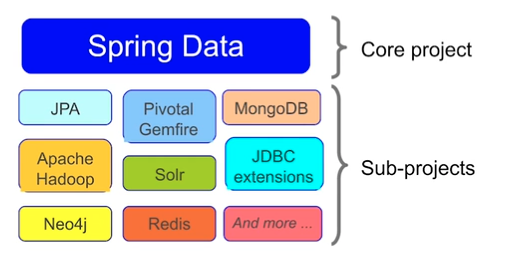

# Spring Boot
- opinionated view of spring fwk
- 3 files to get running
  - pom.xml (<parent>spring-boot-starter-parent</parent>)
  - application.properties
  - Application.class (`@SpringBootApplication`)
- JdbcTemplate bean automatically configured through auto-configuration

## Dependency Management
in the pom

## Spring Boot Properties

### Property files

#### application.properties files
`application.properties` (or `.yml`) found by Spring Boot in this order

- /config from working directory
- the working directory
- config package in classpath
- classpath root

and creates a **PropertySource** based on these files.

#### application-{profile}.properties files

#### multiple profile specific in single file


#### Precedence

1. Devtools settings
2. `@TestPropertySource` and `@SpringBootTest` props
3. Command line args
4. SPRING_APPLICATION_JSON (inline json props)
5. ServletConfig/Context params
6. JNDI attributes from java:comp/env
7. Java System props
8. OS env vars
9. Profile-specific app properties
10. App properties
11. `@PropertySource` files
12. SpringApplication.setDefaultProperties

### @ConfigurationProperties

It simplifies handling of large amount of properties
It maps properties into classes:

```java
@ConfigurationProperties(prefix="rewards.client")
public class ConnectionSettings {
    private String host;
    private int port;
}
```

This must be a Spring managed beans injected in configuration classes. 3 ways to do it:

```java
@SpringBootApplication
@EnableConfigurationProperties(ConnectionSettings.class)
public class RewardsApplication { }
```

```java
@SpringBootApplication
@ConfigurationPropertiesScan
public class RewardsApplication { }
```

```java
@Component
@ConfigurationProperties("rewards.client-connection")
public class ConnectionSettings {
    private String hostUrl;
}
```

**Relaxed binding**, valid matches:

- rewards.client-connection.host-url
- rewards.client_connection.host_url
- rewards.clientConnection.hostUrl
- REWARDS_CLIENTCONNECTION_HOSTURL

## Autoconfiguration

How? SpringBoot provides configuration classes with conditions.
It initialises components based on conditions like:
- do classpath contents include specific classes?
- are some props set?
- are some beans already configured (or not)?

SB auto-configuration is
- managed by a set of auto-configuration classes which uses @Conditional's
- enabled by `@EnableAutoConfiguration`

```java
@SpringBootConfiguration
@ComponentScan("example.config")
@EnableAutoConfiguration
```
equals
```java
@SpringBootApplication(scanBasePackages="example.config")
```

Note : Component Scan in current package onwards (=any subpackage.)

## Override default configuration

Overriding options :

1. Set some Spring Boot's props (`application.properties` files)
2. Explicitly define beans (so SB won't)

Example: A `DataSource.class` defined stops SB from autoconfiguring a default `DataSource`.

3. Explicitly disable some auto-config 
 
via annotation:
```java
@EnableAutoConfiguration(exclude="DataSourceAutoConfiguration.class")
```
or
```java
@SpringBootApplication(exclude = { DataSourceAutoConfiguration.class }) // for multiple excludes
```
via props file:
```yml
spring:
  autoconfigure:
    exclude: org.springframework.boot.autoconfigure.jdbc.DataSourceAutoConfiguration.class
```
4. Change dependencies or their versions

in `pom.xml` with properties or dependencies management sections
```xml
<properties>
  <spring-framework.versions>5.3.22</spring-framework.versions>
</properties>
```

```xml
<dependency>
  <groupID>org.springframework.boot</groupID>
  <artifactId>spring-boot-starter-web</artifactId>
  <exclusions>
    <exclusion>
      <groupID>org.springframework.boot</groupID>
      <artifactId>spring-boot-starter-tomcat</artifactId> // Exclude tomcat
    </exclusion>
  </exclusions>
</dependency>
<dependency>
  <groupID>org.springframework.boot</groupID>
  <artifactId>spring-boot-starter-jetty</artifactId> //use Jetty
</dependency>
```

## Packaging and Runtime
### Spring Boot (Maven) Plugin
"fat" jar including dependencies and tomcat with **Spring Boot  Plugin** (gradle assemble or mvn package) 
- 2 jars are created.
- run with `java -jar mySpringBootApp.jar`
## Integration Test
```java
@SpringBootTest(classes=Application.class)
class MyServiceTests {

}
```
@SpringBootTest searches for @SpringBootConfiguration
```java
@SpringBootConfiguration(classes=Application.class)
@EnableAutoConfiguration
@ComponentScan("example")
class MyServiceTests {

}
```

## Spring Boot JPA

Enabled with
 ```xml
<dependency>
  <groupID>org.springframework.boot</groupID>
  <artifactId>spring-boot-starter-data-jpa</artifactId>
</dependency>
```
If JPA is aon classpath autoconfigures:
- `Datasource`
- `EntityManagerFactoryBean`
- `JpaTransactionManager`

Note : use `@EntityScan` when Entities are in different package than SpringBootApplication class

 ```java
@SpringBootApplication
@EntityScan("rewards.internal")
public class Application {}
```

## Spring Data Repositories for JPA

### Spring Data



- SpringBoot simplifies setup for data access (set up most JPA)
- Spring Data simplifies Repositories (just define an interface)
- ìt reduces boiler plate code.
- implements Instant repositories 
- Scans for interface extended `Repository<T,K>`
- CRUD methods (find, save, delete) auto-generated if using `CrudRepository<T,K>` (extends `Repository`)
- Paging, custom queries and sorting supported

Different Datasources:
- `@Entity` for SQL (map to a sql table). Every Entity needs an `@Id`
- @Document for MongoDB (map to a json document)
- @NodeEntity for Neo4j (map to a graph)
- @Region for Gemfire (map to a region)

```java
public class CustomerRepository extends Repository<Customer, Long> {
  @Query("SELECT c from Customer c WHERE c.emailAddress = ?1")
  Customer findByEmail(String email); // ?1 replace by method param
}
```

Accessing the Repository

```java
@Configuration
@EnableJpaRepositories(basePackages="com.acme.repository")
public class CustomerConfig {
  @Bean
  CustomerService cs(CustomerRepository repo) {
      return new CustomerService(repo);
  }; 
}
```

`@Transient` on a field of Entity = no persisted

# Spring Framework

- opensource framework: helps focus on business logic (pojo programing model)
- lightweight
- DI container (IOC) : spring instantiates and injects dependencies into objects (lifecycle management)
- no need for Java EE application server
- Key principles: DRY, SOC, Convention over config, Testability
- Spring provides templates: JdbcTemplate, JmsTemplate, RestTemplate, WebServiceTemplate ...

## Configuration

- Spring separates application config from application objects (beans)
- Spring manages Objects
  - creates and initialize them 
- Spring gives unique id/name to beans
- Spring Application Context represents Spring DI Container
  - can be created in any env (standalone, web app, JUnit test)
- multiple config with `@Import(MyClass.class)`
- Bean scopes
  - `singleton` (default): single instance
  - `prototype`: new instance created each time the bean is referenced
  - `session`: new instance created once per user session (web only)
  - `request`: new instance created once per request (web only)
  - web socket scope
  - refresh scope
  - thread scope
  - custom scope
- Accessing **external properties**:
  - `@PropertySource("file.properties")` on class
  - or `@Value` on parameter
- Spring **profiles**:
  - can represent 
    - an env (dev, test prod)
    - an impl (jdbc, jpa)
    - a deployment platform (one-premise, cloud)
  - beans are grouped into profiles
  - `@Profile("dev")` or `@Profile("!prod")` can be at
    - class level
    - method level
  - activated at run time with
    - command line : `-Dspring.profiles.active=dev`
    - programmatically: `System.setProperty("spring.profiles.active","dev")` before `SpringApplication.run(AppConfig.class);`
    - Integration Test only: `@ActiveProfiles`
    - with `@Value("${maxAttempts}")`
- Spring **Expression Languages** (SpEL):
   - with `@Value("#{maxAttempts}")` 
     - accessing system properties
     - accessing spring beans
   - can provide a fallback with `@Value("#{maxAttempts: 5}")`

### Component Scanning
- Annotation-based configuration within bean-class `@Configuration @Bean` vs component-scanning with `@Component`
- `@Autowired(required = false)` default is true
- `@Qualifier("beanName")` in parameter or property (after @Autowired )
- `@Component` name auto-generated de-capitalized
- `@Lazy @Component` bean created when dependency injected or when `ApplicationContext.getBean` (default true)
- `@PostConstruct` invoked during bean-creation process (javax not Spring)
- `@PreDestroy` called when ConfigurableApplicationContext is closed. (javax not Spring)
- or alternatively`@Bean(initMethod="populateCache",destroyMethod=""flushCache")`
 
## Spring Container

### LifeCycle


*Spring Beans Initialization Steps*
### Initialization: beans created, DI occurs
#### A.Load & Process : #What should we create ? (Keeps Beans Definition In Memory)
- Load Beans (javaconfig, xml, annotations,component scan ) 
    - gather information about the application context (AC is a BeanFactory)
        - AC BeanFactory : gather bean name, type, scope 
- Post Process Beans Definition 
    - interface BeanFactoryPostProcessor
        - can modify any bean definition before any objects are created
        - some implementation provided by spring : reading properties (`@Value("${max.retries}")`), registering custom scope...
        - Use STATIC for custom BFPP: `@Bean public static BFPP mycustomConfigurer() {}`
#### B. Create and initialize each bean
- Bean created 
    - in right order based on dependencies
    - force dependency order  with `@DependsOn("beanName)`
- Bean initialized *eagerly* (unless marked *lazy*)
    - DI: Instantiate + Setter Injection
- Post Process at bean level BPP(before init & after init)
- Bean ready to use
### Usage: beans available
During previous BPP, bean can be:
1. Just a bean
2. a Proxy

*Bean Or Proxy*

Spring suppports 
- JDK proxy
    - interface based (#implements)
- *CGLib Proxy* 
    - subclass based (#extends)

### Destruction: beans clean up 

1. Any registered `@PreDestroy` methods are invoked
=> Don't happen if application is killed or fails

2. Beans released for Garbage Collection

## Spring AOP (Aspect Oriented Programming)

AOP enables modularization of cross-cutting concerns

**cross-cutting concerns**: generic functionnality needed in many place in the app
- logging and tracing
- transaction management
- security
- caching
- error handling
- perf monitoring
- custom business rules

AOP avoids:
- code tangling: coupling of concers (hard to test)
- code scattering: same concern spread across modules (code duplicates)

AOP technologies:
- Aspect J (JDK proxy)
- Spring AOP (`@Configuration @EnableAspectJAutoProxy`)
 AOP happens during initialization phase: spring wraps the component in a proxy  

### AOP Concepts
#### Join Point
method call or exception trown
#### Pointcut
expression that select one or more join points


- `*` matches only once
- `..` matches zero or more

Any class annnotated *@Cacheable*:

```java
@Before(value = "execution(@example.Cacheable * rewards.. *.*(..))")
```

#### Advice
code to be executed at each join point with:
- `@Before(value= "pointcut execution")`
- `@AfterReturning(value = "", returning="reward")`
- `@AfterThrowing(value="", throwing= "ex")` can return a different type of exception
- `@After()`
- `@Around()` 
    - for before and/or after 
    - need to implement `proceed()` method

#### Aspect 
module (java class) that encapsulates pointcuts and advice annotated with `@Aspect`
#### Weaving
technique by which aspects are combined with main code
#### Proxy
someone else, web proxy etc. 
#### AOP Proxy
class that stand in place (transaction, caching etc.)

### AOP Limits
- only non-private method
- only aspects to spring beans
- weaving proxies inner calls: suppose method @() calls method b() on the same class/interface then advice will never be executed for method b()

## Spring Testing

- Spring TestContext framework provides explicit support for JUnit 4, JUnit Jupiter (AKA JUnit 5), and TestNG
- External dependencies should be minimized
- Isolate with stubs and mocks
- NO need Spring for unit test but YES for integration test
- With Junit5 and Spring'extension via `@ExtendWith(SpringExtension.class)`
- Define spring config to use via `@ContextConfiguration(classes={TestConfig.class})`

`@SpringJUnitConfig(TestConfig.class)` is a composed annotation for:
```java
@ExtendWith(SpringExtension.class)
@ContextConfiguration(classes={TestConfig.class})
```

- `@SpringJunitConfig` without config class specified in () is possible but need to add an inner static class with the config in this test class.
- `@TestPropertySource(properties = "", locations = "")`
- `@ActiveProfiles({"test","jdbc"})`: bean associated to that profil + not associated to any profile
- `@Sql({"schema.sql","data.sql"})`
    - at class runs before each `@Test`
    - method level runs before `@Test` 
    - `@Sql(scripts="cleanup.sql",executionPhase=Sql.ExecutionPhase.AFTER_TEST_METHOD)` runs after `@Test` method
    - `@Sql(scripts= "data.sql", config = @SqlConfig(errorMode = ErrorMode.FAIL_ON_°ERROR, commentPrefix = "//", separator = "@@") )` controls what to do if scripts fails
        - `FAIL_ON_ERROR`
        - `CONTINUE_ON_ERROR`
        - `IGNORE_FAILED_DROPS`
        - `DEFAULT` = whatever `@Sql` defines at class level  otherwise `FAIL_ON_ERROR`


### @DirtiesContext

- forces context to be closed (allows testing of `@PreDestroy`)
- forces Spring to start with a clean slate, as if those other tests hadn't been run.
- add this annotation to all tests which change the data. If not, then these tests could affect the result of other tests
- cached context destroyed, 


## Spring JDBC

### JDBC API limits
- boilerplate code, error prone code
- must check SQLException

### JdbcTemplate
- Rod Johson "Life is too short to write JDBC"
- JDBC template requires a DataSource : `JdbcTemplate template = new JdbcTemplate(datasource);`
- Do not create one for each thread (Inject it in constructor class and re-use it in methods)
- Thread safe after construction  
- JdbcTemplate can query for Simple types (int, long String Date ...), Generic Maps, Domain Objects
- jdbcTemplate.queryForObject
    - connection acquisition
    - transaction participation
    - statement execution
    - resultset process (results.add(rowMapper.mapRow(resultset,rowNumber)))
    - exception handling
    - connection release
```java
int count = jdbcTemplate.queryForObject("SELECT blabla", Integer.class);
```
- Query with bind variable using `?`
```java
String sql = "SELECT count(1) from PERSON WHERE age > ? and education = ?";
int count = jdbcTemplate.queryForObject(sql, Integer.class, age, education.toString());
```
- jdbcTemplate.insert DOES NOT EXIST. Any non-SELECT SQL is run using `jdbcTemplate.update()`:
```java
jdbcTemplate.update("INSERT INTO PERSON (name,age) VALUES (?,?)", person.getName(), person.getAge());
``` 

- JdbcTemplate can return each row of a rs as a Map
    - expecting single row: use `queryForMap`
    - expecting multiple rows: use `queryForList` returns a List of Map

```java
Map<String,Object> getPersonDetails(String id) {
    return jdbcTemplate.queryForMap("SELECT * FROM PERSON where ID = ? ", id);
}
// Returns Map of key (column name) value (column values)
// Map { ID = 1, FIRST_NAME="John", LAST_NAME="Doe"}
```

```java
List<Map<String,Object>> getAllPersons() {
    return jdbcTemplate.queryForList("SELECT * FROM PERSON");
}
// Returns List of Maps  
// List {
// 0 - Map { ID = 1, FIRST_NAME="John", LAST_NAME="Doe"}
// 1 - Map { ID = 2, FIRST_NAME="Bod", LAST_NAME="Smith"}
// 2 - Map { ID = 3, FIRST_NAME="Sarah", LAST_NAME="Connor"}
// }
//}
```

#### RowMapper functional interface 
```java
@FunctionalInterface
public interface RowMapper<T> {
  T mapRow(ResultSet rs, int rowNum) throws SQLException;
  }
```

- for mapping a single row of a rs to an object
- used for both single or multiple row queries
- return type paramatized
##### Query for single row
- Map rs with one domain object with jdbcTemplate.queryForObject (with lambda or callback)
```java
Customer customer = jdbcTemplate.queryForObject("SELECT * PERSON where ID = ?",
(rs, rowNum) -> new Customer(rs.getString(name)), id);
```
or
```java
	public Restaurant findByMerchantNumber(String merchantNumber) {
		String sql = "select MERCHANT_NUMBER, NAME, BENEFIT_PERCENTAGE, BENEFIT_AVAILABILITY_POLICY"
				+ " from T_RESTAURANT where MERCHANT_NUMBER = ?";
		return jdbcTemplate.queryForObject(sql, new
        RowMapper<Restaurant>() {
          public Restaurant mapRow(ResultSet rs, int rowNum) throws SQLException {
            return mapRestaurant(rs);
          }
        }, merchantNumber);
	}
```
##### Query for multiple rows
- Map rs with list of domain objects with jdbcTemplate.query (with callback with explicit RowMapper)
```java
List<Customer> customers = jdbcTemplate.query("SELECT blabla", 
new RowMapper<Customer>(){
    public Customer mapRow(ResultSet rs, int rowNum) throws SQLException ¶
    // do the mapping from rs
})
```

#### ResultSetExtracor functional interface
```java
@FunctionalInterface
public interface ResultSetExtractor<T> {
  T extractData(ResultSet rs) throws SQLException, DataAccessException;
}
```
- for mapping an entire rs to an object
    - n to one Mapping
    - #sqlWithJoin
- iterating on rs not automatic => `while(rs.next()) {rs.getString("name") blabla}`
- 

#### RowCallbackHandler functional interface
```java
@FunctionalInterface
public interface RowCallbackHandler<T> {
  void processRow(ResultSet rs) throws SQLException, DataAccessException;
}
```

### Exception handling

#### Checked Exceptions
- force developers to handle erros
- ex: SQLException 
#### Unchecked Exceptions
- Spring always throws Runtime (unchecked) Exceptions 
- `DataAccessException` hierarchy of sub-exceptions that hides whether using JPA, Hibernate, JDBC etc.
     - BadSqlGrammarException (column not found eg)
     - DataIntegrityViolationException
     - DataAccessResourceFailureException
     - CleanupFailureDataAccessException
     - OptimisticLocking Exception


## Spring Transaction Management

### Non-Transactional
When a unit-of-work containes 4 data access operations (eg SELECT, SELECT, UPDATE, INSERT), each acquires, uses and releases a distinct Connection. 

### Transactional
- Enable concurrent access to a shared resource.
- A set of tasks which take place as a single, indivisible action
- A unit of work that should be ATOMIC
#### Atomic 
Each unit of work is an All-or-nothing operation
#### Consistent
Database integrity Constraints are never violated
#### Isolated
Isolating transactions from each other
#### Durable
Committed changes are permanent (#final )

### Implementation
1. Declare a `PlatformTransactionManager` bean. Several implementation available:
  - DataSourceTransactionManager
  - JmsTransactionManager
  - JpaTransactionManager
  - JtaTransactionManager
  - WebLogicJtaTransactionManager
  - WebSphereUowTransactionManager
```java
@Bean
public PlatformTransactionManager transactionManager(DataSource dataSource) {
  return new DataSourceTransactionManager(datasource);
}
```
Declare `@Transactional` above relevant class or method(props overrided )
- wrapped in a proxy with *around* advice
- Rollback if method throws a Runtime Exception. Checked exceptions don't. (unless config specifies the contrary)
- commit at the end of the method
- transaction started before entering the method
- all controlled by config
2. Add `@EnableTransactionManagement` in config class

Transaction bound to current thread.
- holds underlying JDBC connection
- access manually with `DataSourceUtils.getConnection(datasource)`
- different from javax.transaction.Transactional (fewer options, supported by Spring)

### Transaction Propagation
Wether Connection to datasource gets opened/closed.
#### REQUIRED (default)
`@Transactional(propagation=Propagation.REQUIRED)`
Needs a connection. Takes the current if exists or create a new one.
#### REQUIRES_NEW
`@Transactional(propagation=Propagation.REQUIRES_NEW)`

Since it uses an around advice, no new connection acquired because the *update2()* method is into a method with around advice.
The propagation rule does not get applied because the call is internal (the inner call does not go through a proxy.)
*update1()* and *update2()* will participate in the same transaction
```java
class ClientService {
  @Transactional(propagation=Propagation.REQUIRED)
  void update1() {
    update2()
  }
    @Transactional(propagation=Propagation.REQUIRES_NEW)
  void update2() {
  }
}
```
### Rollback Rules
#### Default
Rollback if method throws a Runtime Exception. Checked exceptions don't. (unless config specifies the contrary)
#### Overridden
```java
  @Transactional(rollbackFor=MyCheckedException.class,
              noRollbackFor={JmxException.class, MailException.class})
  public RewardConfirmation rewardAccount() throws Exception {
    
  }
```
### Testing Transaction
Annotate test method with `@Transactional` 
- Transaction rolled back afterwards
Annotate class with `@Transactional` 
- all tests transactional
- add `@Commit` for test method we want to commit data. 

## Spring Web

- @RestController @RequestMapping("/cashcards")
    - @PostMapping, @PutMapping("/{id}"), @GetMapping("/{id}") @DeleteMapping"/{id}"

### ResponseEntity
- Spring Web (or http) provides the .created()
    - ResponseEntity.created(uriOfCashCard).build(); => returns the uri in the Header Location
- UriComponentsBuilder ucb: method argument to POST handler method automatically passed in (injected from our friend, Spring's IoC Container.)
- restTemplate
    - withBasicAuth(user, pwd) 
    - getForEntity(url, responseType) => returns ResponsEntity
    - postForEntity(url, request, responseType) => returns ResponsEntity
    - putForEntity() DOES NOT EXIST!
    - exchange(url, method, request, responseType) => returns ResponsEntity
    - delete => returns void

## Spring Data
### PagingAndSortingRepository
- comes from Spring Data Pagination API
    - Provides `PageRequest` and `Sort` classes for pagination
- implements CrudRepository
- Spring Data's CrudRepository provides methods that support creating, reading, updating, and deleting data from a data store. cashCardRepository.save returns the saved object with a unique id provided by the database.

```java
Page<CashCard> page2 = cashCardRepository.findAll(
    PageRequest.of(
        1,  // page index for the second page - indexing starts at 0
        10, // page size (the last page might have fewer items)
        Sort.by(new Sort.Order(Sort.Direction.DESC, "amount"))));
```

### Pageable
allows Spring to parse out the 'page' number and 'size' query string parameters.
getSortOr() : no default so has to be specified

```java
PageRequest.of(
                   pageable.getPageNumber(),
                   pageable.getPageSize(),
                   pageable.getSortOr(Sort.by(Sort.Direction.DESC, "amount"))));
```
### Page
`page.getContent()`

## Spring Security

### Authentication

- act of Principal proving its identity to the system
- `Principal` : user of an API, person or  program.
- Principal provides credentials:
    - eg a Basic Authentication (user/pwd) to get a `Session Token` (stored in a `cookie`) passed to next requests. (providing credentials at every request is inefficient)
- `Filter Chain`
    - Spring Security authentication implementation
    - Component called prior to the Controller
    - Checks the user’s authentication

### Authorization

- Spring Security provides Authorization via Role-Based Access Control (RBAC) #permissions
- RBAC configured at both a global level or a per-method basis

### Same Origin Policy

- Same Origin Policy (SOP)
- relax the SOP with Cross-Origin Resource Sharing (CORS)
    - `@CrossOrigin` annotation without any arguments allows all origins /!\ 

### Common Web Exploits

#### Cross-Site Request Forgery
- pronounced “Sea-Surf”, and also known as `Session Riding`
-  CSRF Token for protection
- only actions that a user is authorized to do can be executed.
- Spring Security has built-in support for CSRF tokens which is enabled by default

#### Cross-Site Scripting (XSS)
- even more malicious since any script could be run

### Configuration

Adding org.springframework.boot:spring-boot-starter-security without any config locks down the app. (need to specify how authentication and authorization are performed)

`@Configuration` tells Spring to use this class to configure Spring and Spring Boot itself.
Any Beans specified in this class will now be available to Spring's <b>Auto Configuration engine</b>.
Spring Security expects a Bean to configure its Filter Chain

```java
@Configuration
class SecurityConfig {

    @Bean
    SecurityFilterChain filterChain(HttpSecurity http) throws Exception {
        http
             .authorizeHttpRequests(request -> request
                     .requestMatchers("/cashcards/**")
                     .authenticated())
             .httpBasic(Customizer.withDefaults()) //user+pwd
             .csrf(csrf -> csrf.disable());
        return http.build();
    }
}
```

   CashCard findByIdAndOwner(Long id, String owner);
   Page<CashCard> findByOwner(String owner, PageRequest pageRequest);
